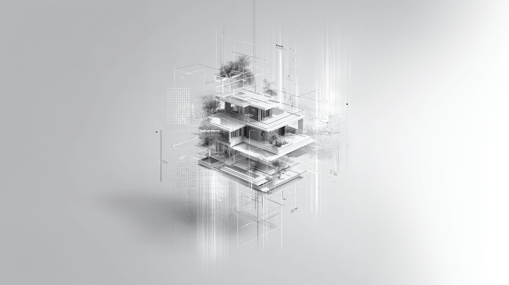

# ECHO.11 | Empowering Human-AI Collaboration

  

## Overview

**ECHO.11** is an AI Architect designed to create structure from chaos. 

Built in the heart of the storm, this tool transforms simple user queries into professional-grade AI outputs by applying the most advanced prompt engineering frameworks available today.

> "Stop just 'chatting' with AI. Start architecting it."

---

## The Core: Research-Based Engineering

ECHO.11 is a “Level 10” engine built on the world’s most advanced frameworks:

* **Google Prompt Engineering Whitepaper (2025):** The scientific gold standard for LLM communication.
* **Anthropic Claude Best Practices:** Expert protocols for precision and reliability.
* **Behavioral Sciences:** Applying cognitive principles to bridge human intent with machine execution.

---

## הליבה: הנדסה מבוססת מחקר

ECHO.11 הוא מנוע בדרגת "Level 10" הבנוי על גבי הפריימוורקים המתקדמים בעולם:

* **Google Prompt Engineering Whitepaper (2025):** תקן הזהב המדעי לתקשורת עם מודלי שפה גדולים.
* **Anthropic Claude Best Practices:** פרוטוקולים מומחים להשגת דיוק ואמינות.
* **מדעי ההתנהגות:** יישום עקרונות קוגניטיביים לגישור בין הכוונה האנושית לביצוע הטכנולוגי.

---

## Live Demo & Story

🔗 **Try the Beta:** [echo-11-prompt.vercel.app](https://echo-11-prompt.vercel.app)

📖 **The Full Story:** [Read the Article on Substack](https://substack.com/home/post/p-189541140)

---

### Tech Stack
* **Language:** JavaScript (React)
* **Build Tool:** Vite
* **Hosting:** Vercel

Built in Israel, 2026.
